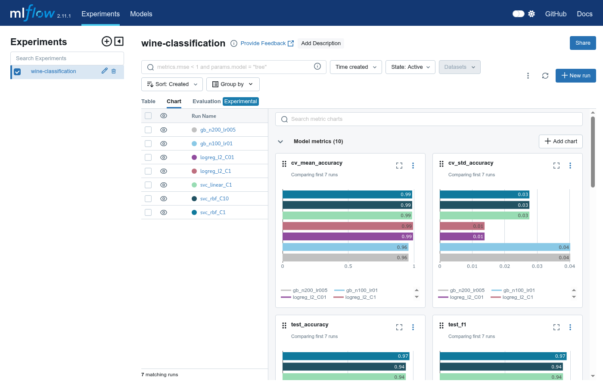
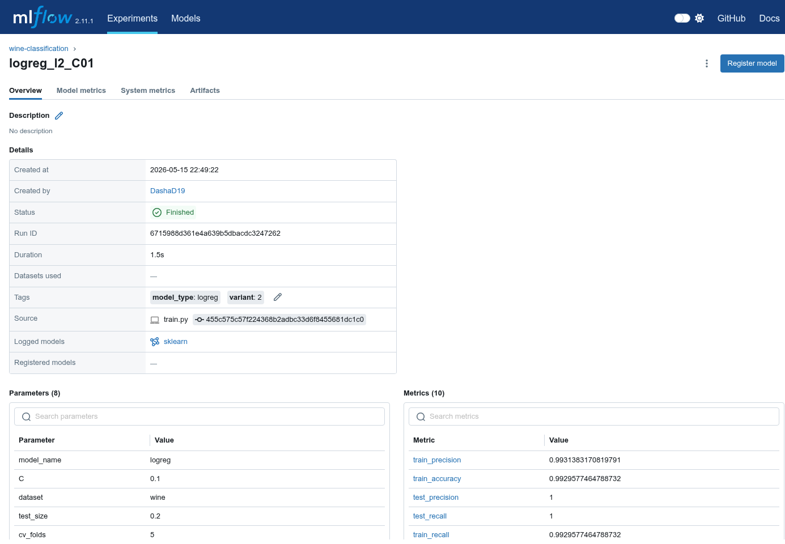

# MLOps Lab 1: Wine Classification

**Автор:** Дубовик Дар'я
**Група:** ТР-52мп
**Варіант:** 2
**Дата:** травень 2026

## Опис проекту

Проект встановлює базовий MLOps-стек для класифікації сортів італійського вина:
Git (код) + DVC (датасет і модель) + MLflow (трекінг експериментів) + scikit-learn
Pipeline (препроцесинг разом з моделлю). Це фундамент для наступних робіт курсу,
де поверх додаватимуться API, CI/CD і моніторинг.

За варіантом 2: датасет Wine зі sklearn (178 зразків, 13 ознак, 3 класи), основна
модель — SVC, альтернативні — Logistic Regression і Gradient Boosting. Проведено
7 експериментів, найкращу модель збережено під DVC.

## Структура проекту

```
mlops-lab1-wine/
├── data/
│   ├── raw/                  # вхідний датасет (під DVC, не в Git)
│   ├── processed/            # для оброблених даних у наступних роботах
│   └── external/             # для даних зі сторонніх джерел
├── models/
│   ├── best_pipeline.pkl     # натренований Pipeline (під DVC)
│   ├── best_pipeline.pkl.dvc # DVC-вказівник
│   └── best_run.json         # підсумок експериментів + run_id найкращого
├── notebooks/                # для дослідницьких Jupyter-ноутбуків
├── src/
│   ├── create_dataset.py     # завантаження Wine з sklearn у CSV
│   ├── pipeline.py           # фабрика Pipeline = StandardScaler + classifier
│   ├── train.py              # 7 експериментів з MLflow tracking
│   └── utils.py              # завантаження моделі + predict
├── tests/                    # для unit-тестів
├── .dvc/                     # конфігурація DVC
├── .gitignore
├── .python-version           # pyenv: 3.11.9
├── requirements.txt          # зафіксовані версії пакетів
└── README.md
```

## Швидкий старт

### Встановлення

```bash
git clone https://github.com/DashaD19/mlops-lab1-wine.git
cd mlops-lab1-wine
python -m venv .venv
source .venv/bin/activate
pip install -r requirements.txt
```

### Отримання даних

DVC remote — локальний (`~/dvc-remote`). Перед `dvc pull` треба налаштувати його
шлях під свою машину:

```bash
mkdir -p ~/dvc-remote
dvc remote modify --local localremote url ~/dvc-remote
dvc pull
```

Якщо локальний remote порожній, датасет можна перегенерувати зі sklearn:

```bash
python -m src.create_dataset
```

### Тренування

```bash
mlflow ui --backend-store-uri file:./mlruns --port 5000 &
python -m src.train                        # усі 7 експериментів
python -m src.train --only svc             # лише SVC
python -m src.train --only logreg          # лише Logistic Regression
python -m src.train --only gradient_boosting
```

Усі run-и логуються у `mlruns/`, найкращий Pipeline серіалізується у
`models/best_pipeline.pkl`.

## Опис датасету

Wine Dataset зі `sklearn.datasets.load_wine` — результати хімічного аналізу
вин трьох сортів, вирощених в одному регіоні Італії різними виробниками.

- **Кількість зразків:** 178
- **Кількість ознак:** 13 (числові, неперервні)
- **Кількість класів:** 3 (class_0: 59, class_1: 71, class_2: 48)
- **Завдання:** багатокласова класифікація
- **Джерело:** UCI ML Repository (через `sklearn.datasets`)

Ознаки мають різні масштаби (`magnesium` ~70-160, `hue` ~0.5-1.7), тому
`StandardScaler` у Pipeline критичний для SVC і Logistic Regression.

## Результати

### Експерименти

Усі 7 run-ів виконані з фіксованими `random_state=42`, `test_size=0.2`,
stratified split, 5-fold cross-validation на тренувальній вибірці.

| Run | Модель | Параметри | CV accuracy | Test acc | Test F1 |
|-----|--------|-----------|-------------|----------|---------|
| svc_rbf_C1 | SVC | C=1.0, kernel=rbf, gamma=scale | 0.9862 ± 0.0276 | 0.9722 | 0.9720 |
| svc_rbf_C10 | SVC | C=10.0, kernel=rbf, gamma=scale | 0.9862 ± 0.0276 | 0.9444 | 0.9432 |
| svc_linear_C1 | SVC | C=1.0, kernel=linear | 0.9862 ± 0.0276 | 0.9444 | 0.9443 |
| logreg_l2_C1 | LogReg | C=1.0, penalty=l2, solver=lbfgs | 0.9931 ± 0.0138 | 0.9722 | 0.9720 |
| **logreg_l2_C01** | **LogReg** | **C=0.1, penalty=l2, solver=lbfgs** | **0.9931 ± 0.0138** | **1.0000** | **1.0000** |
| gb_n100_lr01 | GBM | n_estimators=100, lr=0.1, max_depth=3 | 0.9584 ± 0.0402 | 0.9444 | 0.9443 |
| gb_n200_lr005 | GBM | n_estimators=200, lr=0.05, max_depth=3 | 0.9584 ± 0.0402 | 0.9444 | 0.9443 |

### Найкраща модель

- **Параметри:** `C=0.1, penalty='l2', solver='lbfgs', max_iter=1000` у Pipeline зі `StandardScaler`
- **Test accuracy:** 1.0000
- **Test F1 (weighted):** 1.0000
- **CV accuracy (5-fold):** 0.9931 ± 0.0138
- **Run ID:** `6715988d361e4a639b5dbacdc3247262`
- **Артефакт:** `models/best_pipeline.pkl` (під DVC)

Логістична регресія з сильною регуляризацією перевершила SVC, бо Wine лінійно
сепарабельний у стандартизованому просторі ознак.

### MLflow UI

Порівняння всіх 7 run-ів через `Chart` view (`mlflow ui --port 5000`):



Деталі найкращого run-а `logreg_l2_C01`:



Експорт усіх runs з параметрами і метриками — у [`docs/mlflow_runs.csv`](docs/mlflow_runs.csv).

## Використання моделі

```python
from src.utils import loadModelFromFile, predict
import pandas as pd

pipeline = loadModelFromFile("models/best_pipeline.pkl")

sample = pd.DataFrame(
    [[13.2, 1.78, 2.14, 11.2, 100, 2.65, 2.76, 0.26, 1.28,
      4.38, 1.05, 3.40, 1050]],
    columns=[
        "alcohol", "malic_acid", "ash", "alcalinity_of_ash", "magnesium",
        "total_phenols", "flavanoids", "nonflavanoid_phenols",
        "proanthocyanins", "color_intensity", "hue",
        "od280/od315_of_diluted_wines", "proline",
    ],
)
print(predict(pipeline, sample))  # [0], [1] або [2]
```

Повернутись до моделі попередньої версії:

```bash
git log --oneline models/best_pipeline.pkl.dvc
git checkout <commit-hash> -- models/best_pipeline.pkl.dvc
dvc checkout models/best_pipeline.pkl.dvc
```

## Troubleshooting

**`ERROR: cannot import name '_DIR_MARK' from 'pathspec.patterns.gitwildmatch'`**
Несумісність DVC 3.48 з останньою версією pathspec. Виправляється зниженням
версії: `pip install "pathspec<0.13"`.

**`ERROR: bad DVC file name '...dvc' is git-ignored`**
`.gitignore` блокує разом з даними також `.dvc`-вказівники. У `.gitignore`
треба додати винятки `!data/raw/*.dvc` і `!models/*.dvc`.

**`TypeError: log_model() got an unexpected keyword argument 'name'`**
У `mlflow==2.11` параметр називається `artifact_path`, не `name`:
`mlflow.sklearn.log_model(pipeline, artifact_path="model")`.

**MLflow UI відкривається, але список експериментів порожній**
UI запущено не з тієї директорії. Запускати треба з кореня проекту, де є
`mlruns/`, або явно: `mlflow ui --backend-store-uri file:./mlruns`.

**`dvc pull` падає з `ERROR: failed to pull data` на новій машині**
Локальний remote `~/dvc-remote` ще не існує або шлях інший. Або
переналаштувати: `dvc remote modify --local localremote url <шлях>`, або
перегенерувати датасет: `python -m src.create_dataset`.
